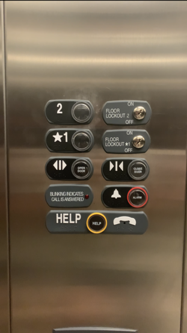
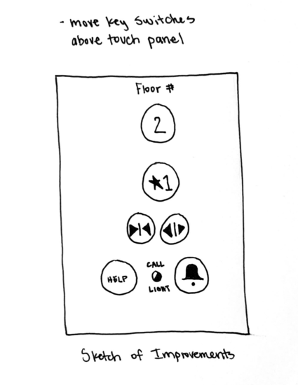

# CS3366-HW1

### Links
[Presentation page](https://blainesieck.github.io/CS3366-HW1/.) (e.g. https://blainesieck.github.io/CS3366-HW1/., contains content of this README)

[GitHub repository](https://github.com/BlaineSieck/CS3366-HW1) (e.g. https://github.com/BlaineSieck/CS3366-HW1)

**To get a C:**

Petroleum Engineering Building Elevator

**Find issues with the current design**
- the key switches are odd, I don’t think I’ve ever seen an elevator with key switches before
- some of the key switches are with the buttons and some are high above them which seems disorganized

**Explain why it is bad**
- some may confuse the key switches for buttons
- it would be better to have all the key switches separate from the main buttons to keep it simpler and less confusing

**To get a B:**

**List your most common uses and other more rare uses**
- Common uses include: going to a floor, force closing the door, and holding the door open
- Rare uses include: sounding the emergency alarm and using the phone
- the interface is already very simple and easy to use, but it could be simpler
- the existing interface makes all of these things easy, the switches are just distracting and in the way

**How does the user interact with the elevator**
- most common sequence of actions is probably just walking in and pressing a floor button then exiting the elevator

**How does the elevator support the user figuring out how to make it work?**
- the design is simple, the user should be able to figure it out
- everything is clearly labeled

**How does the elevator provide feedback to the user?**
- The buttons light up when pressed

**What are some common mistakes you can make with the current design?**
- Maybe misidentifying the switches as buttons, but this is unlikely

**Suggest improvements to the control interface**
- I would suggest moving the switches to a separate area from the control buttons
- I would also keep the alarm and phone on the same row
- I would also label the buttons instead of having extra labels next to the buttons

**Gif of redesigned interface**

